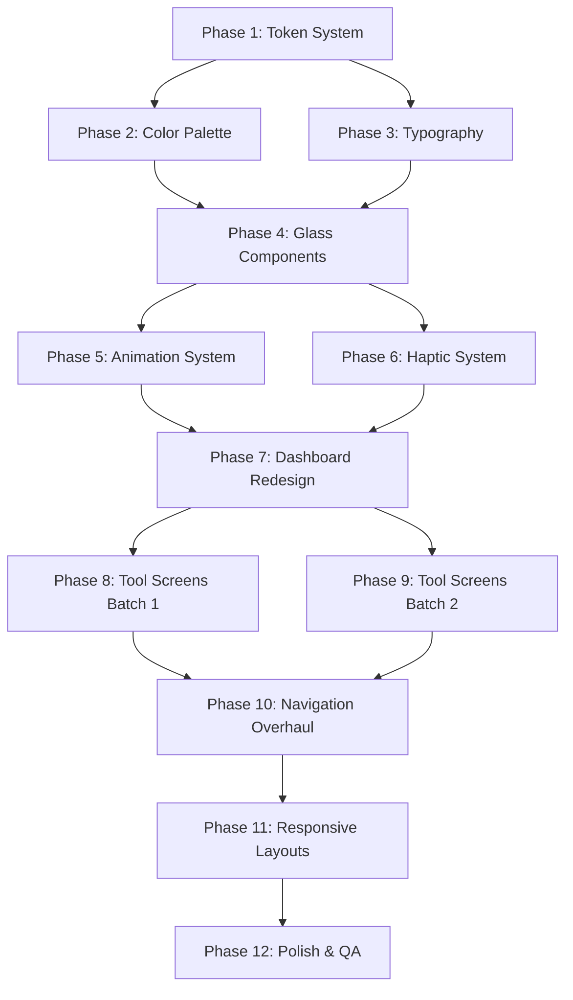

# 🌌 ANEGAN V3.2 — NOVA UPDATE
## The Futuristic Redesign — Comprehensive Engineering Specification

> **Version**: 3.2 | **Codename**: Nova
> **Base Version**: 3.1 (Eclipse) | **App ID**: com.anegan.app
> **Architecture**: Kotlin + Jetpack Compose + Material Design 3
> **Design Philosophy**: Neo-Brutalism × Glassmorphism × Cyberpunk
> **Goal**: Transform every pixel into a futuristic, immersive, sci-fi experience

---

# TABLE OF CONTENTS

1. [Executive Summary & Design Philosophy](#1-executive-summary--design-philosophy)
2. [Design Token System — Complete Specification](#2-design-token-system--complete-specification)
3. [Color Harmony System — 60-30-10 Neon Palette](#3-color-harmony-system--60-30-10-neon-palette)
4. [Typography System — Dynamic Neo-Brutalist Type](#4-typography-system--dynamic-neo-brutalist-type)
5. [Spatial Depth & Glassmorphism Layer System](#5-spatial-depth--glassmorphism-layer-system)
6. [Component Library — Futuristic Primitives](#6-component-library--futuristic-primitives)
7. [Micro-Interaction & Animation Blueprint](#7-micro-interaction--animation-blueprint)
8. [Haptic Feedback Architecture](#8-haptic-feedback-architecture)
9. [Gesture System — Spatial & Ergonomic](#9-gesture-system--spatial--ergonomic)
10. [Screen Redesign — Home Dashboard (NOVA)](#10-screen-redesign--home-dashboard-nova)
11. [Screen Redesign — All Tool Screens (35 Screens)](#11-screen-redesign--all-tool-screens-35-screens)
12. [Responsive Layout System](#12-responsive-layout-system)
13. [Navigation System Overhaul](#13-navigation-system-overhaul)
14. [Performance & Rendering Strategy](#14-performance--rendering-strategy)
15. [Verification & Testing Plan](#15-verification--testing-plan)
16. [Execution Roadmap (12 Phases)](#16-execution-roadmap-12-phases)

---

# 1. EXECUTIVE SUMMARY & DESIGN PHILOSOPHY

## 1.1 The Problem

Anegan V3.1 "Eclipse" is feature-complete with 35+ tools across 11 modules. However, the UI/UX remains fundamentally **utilitarian** — flat cards, static grids, minimal animation, and a conventional Material Design appearance. The app looks like a well-organized toolbox but does not feel like the future.

### Current Design Audit — Critical Gaps

| Gap | Current State | Impact |
|-----|---------------|--------|
| **Visual Identity** | Generic Material Design cards and buttons | App blends in with thousands of similar utility apps |
| **Animation Coverage** | Only 2 animations exist: widget press scale (0.92f) and card press scale (0.97f) | Interface feels static and lifeless |
| **Color System** | 29 separate gradient pairs with no unifying harmony | Visual chaos — each tool looks like it belongs to a different app |
| **Typography** | Mix of hardcoded sp sizes (10sp–30sp) with no dynamic scaling | Inconsistent hierarchy, poor glanceability |
| **Depth System** | Flat cards with 2dp elevation, no blur/glass effects | No spatial depth, no layered information architecture |
| **Gesture Support** | Only tap and scroll — no swipe navigation, no edge gestures | Limited interaction vocabulary |
| **Haptics** | Only `LongPress` and `TextHandleMove` types | No contextual tactile feedback |
| **Loading/Transition States** | Instant screen swaps with basic slide animation | Jarring navigation, no continuity between screens |
| **Empty States** | Basic text + icon | No personality, no delight |
| **Responsive Design** | Single layout for all screen sizes | Poor tablet/foldable experience |
| **Dark Mode** | Functional but not premium — uses standard dark grays | Not a true cyberpunk/neon dark experience |

## 1.2 The Vision — Three Design Pillars

### Pillar 1: Neo-Brutalism (Structure)
- **Bold, thick typography** with dramatic weight contrasts (100→900)
- **Raw, visible borders** with intentional offset shadows
- **Unapologetic visual hierarchy** — important things are LOUD
- **Geometric precision** in grid layouts
- **High-contrast, legible interfaces** even in extreme conditions

### Pillar 2: Glassmorphism (Depth)
- **Translucent card surfaces** with `RenderEffect.createBlurEffect`
- **Multi-layer depth system** (background → substrate → surface → overlay → modal)
- **Frosted glass panels** that reveal motion behind them
- **Soft, ambient glow** around focused elements
- **Floating UI** that feels suspended in 3D space

### Pillar 3: Cyberpunk (Energy)
- **Neon accent colors** that pulse and breathe
- **Electric gradients** with animated sweep directions
- **Holographic shimmer effects** on premium surfaces
- **Scanline/grid texture overlays** on backgrounds
- **Data visualization aesthetics** — hex codes, mono fonts, terminal vibes

## 1.3 Design Mantra

> **"Every pixel pulses. Every tap responds. Every screen breathes."**

The interface should feel like a living, reactive organism — not a static arrangement of rectangles.

---

# 2. DESIGN TOKEN SYSTEM — COMPLETE SPECIFICATION

## 2.1 Token Architecture

All visual properties are centralized into a hierarchical token system:

```
NovaTokens/
├── Color/           (all color values)
├── Typography/      (all text styles)
├── Spacing/         (all dimensional values)
├── Radius/          (all corner radii)
├── Elevation/       (all shadow/depth values)
├── Blur/            (all glassmorphism blur values)
├── Animation/       (all duration/easing curves)
├── Opacity/         (all alpha values)
└── Haptic/          (all vibration patterns)
```

### Implementation

#### [NEW] `NovaTokens.kt` in `core/designsystem/src/main/java/com/anegan/core/designsystem/theme/`

```kotlin
object NovaTokens {

    // ═══════════════════════════════════════════
    // SPACING — 8pt Base Grid
    // ═══════════════════════════════════════════
    object Spacing {
        val none = 0.dp
        val xxxs = 2.dp      // Hairline gaps
        val xxs = 4.dp       // Icon-to-label gaps
        val xs = 8.dp        // Tight internal padding
        val sm = 12.dp       // Card internal padding
        val md = 16.dp       // Section spacing
        val lg = 20.dp       // Component spacing
        val xl = 24.dp       // Section margins
        val xxl = 32.dp      // Page margins
        val xxxl = 40.dp     // Hero spacing
        val mega = 56.dp     // Full-bleed spacing
        val ultra = 72.dp    // Dramatic spacing
    }

    // ═══════════════════════════════════════════
    // CORNER RADIUS — Graduated Scale
    // ═══════════════════════════════════════════
    object Radius {
        val none = 0.dp
        val xs = 4.dp        // Small badges, chips
        val sm = 8.dp        // Buttons, inputs
        val md = 12.dp       // Small cards
        val lg = 16.dp       // Standard cards
        val xl = 20.dp       // Large cards
        val xxl = 24.dp      // Premium cards
        val pill = 999.dp    // Full pill shape
        val circle = 50      // Percentage-based circle
    }

    // ═══════════════════════════════════════════
    // ELEVATION — Spatial Depth Layers
    // ═══════════════════════════════════════════
    object Elevation {
        val flat = 0.dp       // Background elements
        val subtle = 1.dp     // Barely raised
        val low = 2.dp        // Standard cards
        val medium = 4.dp     // Elevated cards
        val high = 8.dp       // Floating elements
        val mega = 12.dp      // Modals, sheets
        val ultra = 24.dp     // Tooltips, dropdowns
    }

    // ═══════════════════════════════════════════
    // BLUR — Glassmorphism Radii
    // ═══════════════════════════════════════════
    object Blur {
        val none = 0f
        val subtle = 8f       // Hint of glass
        val light = 16f       // Soft frosted glass
        val medium = 24f      // Standard glass card
        val heavy = 32f       // Dense frosted glass
        val ultra = 48f       // Maximum blur (modals)
        val background = 64f  // Background substrate blur
    }

    // ═══════════════════════════════════════════
    // OPACITY — Alpha Values
    // ═══════════════════════════════════════════
    object Opacity {
        val invisible = 0.0f
        val ghost = 0.04f      // Barely visible tints
        val whisper = 0.08f    // Subtle bg tints
        val faint = 0.12f      // Borders, dividers
        val soft = 0.2f        // Overlay backgrounds
        val medium = 0.4f      // Secondary text on glass
        val strong = 0.6f      // Primary text on glass
        val heavy = 0.8f       // Dense overlays
        val opaque = 1.0f      // Fully opaque
    }

    // ═══════════════════════════════════════════
    // TOUCH — Minimum Target Sizes
    // ═══════════════════════════════════════════
    object Touch {
        val minimum = 48.dp          // WCAG minimum
        val comfortable = 56.dp      // Calculator keys, utility buttons
        val large = 64.dp            // Primary CTAs
        val hero = 72.dp             // Hero action buttons
    }

    // ═══════════════════════════════════════════
    // ANIMATION — Duration & Easing
    // ═══════════════════════════════════════════
    object Motion {
        // Durations
        val instant = 100           // Micro-feedback (color change)
        val fast = 200              // Small element transitions
        val normal = 300            // Standard transitions
        val slow = 500              // Page transitions
        val dramatic = 800          // Hero animations
        val cinematic = 1200        // Splash/onboarding

        // Spring Configurations
        val springSnappy = spring<Float>(dampingRatio = 0.6f, stiffness = 800f)
        val springBouncy = spring<Float>(dampingRatio = 0.4f, stiffness = 400f)
        val springSmooth = spring<Float>(dampingRatio = 0.8f, stiffness = 300f)
        val springGentle = spring<Float>(dampingRatio = 0.9f, stiffness = 200f)

        // Press scale values
        val pressScaleWidget = 0.88f   // Deep press for widgets
        val pressScaleCard = 0.95f     // Subtle press for cards
        val pressScaleButton = 0.92f   // Medium press for buttons
    }

    // ═══════════════════════════════════════════
    // ICON — Size Scale
    // ═══════════════════════════════════════════
    object IconSize {
        val xxs = 12.dp       // Badges
        val xs = 16.dp        // Inline indicators
        val sm = 20.dp        // Secondary icons
        val md = 24.dp        // Standard icons
        val lg = 28.dp        // Emphasized icons
        val xl = 32.dp        // Card header icons
        val xxl = 40.dp       // Hero icons
        val mega = 56.dp      // Dashboard widget icons
    }

    // ═══════════════════════════════════════════
    // WIDGET — Dashboard Grid
    // ═══════════════════════════════════════════
    object Widget {
        val iconContainerSize = 64.dp    // Was 52dp → larger for thumb targets
        val iconSize = 28.dp             // Was 24dp → more visible
        val badgeSize = 20.dp            // Was 16dp → more visible
        val labelMaxWidth = 80.dp        // Was 72dp → less truncation
        val gridColumns = 4              // Was 3 → denser grid, more tools visible
        val gridSpacing = 12.dp          // Uniform gap between items
        val sectionCorner = 24.dp        // Was 20dp → softer
    }
}
```

---

# 3. COLOR HARMONY SYSTEM — 60-30-10 NEON PALETTE

## 3.1 The 60-30-10 Rule Applied

The entire app uses a strict color distribution:

| Layer | Percentage | Role | Light Mode | Dark/AMOLED Mode |
|-------|-----------|------|------------|-----------------|
| **60% — Dominant** | Background, empty space | Calm, receding | `#F0F2F5` (Cool Gray 50) | `#0A0A0F` (Void Black) |
| **30% — Structural** | Cards, text, borders, toolbars | Readable, organized | `#1A1A2E` (Deep Ink) | `#E8ECF4` (Frost White) |
| **10% — Accent** | CTAs, active states, neon glow | Energetic, focused | Category-specific neon | Category-specific neon |

## 3.2 Nova Color Palette

#### [NEW] Complete color system replacing current Color.kt

```kotlin
// ═══════════════════════════════════════════════════════
// NOVA COLOR PALETTE — Futuristic Neon Harmony
// ═══════════════════════════════════════════════════════

// ─── CORE BACKGROUNDS (60% Layer) ───
val NovaVoidBlack       = Color(0xFF0A0A0F)    // AMOLED pure void
val NovaDeepSpace       = Color(0xFF0D1117)    // Dark mode background
val NovaMidnightBlue    = Color(0xFF161B22)    // Dark mode surface
val NovaDarkSlate       = Color(0xFF21262D)    // Dark mode elevated surface
val NovaGhostWhite      = Color(0xFFF0F2F5)    // Light mode background
val NovaPureWhite       = Color(0xFFFFFFFF)    // Light mode surface
val NovaCoolGray50      = Color(0xFFF8F9FA)    // Light mode substrate
val NovaCoolGray100     = Color(0xFFE9ECEF)    // Light mode dividers

// ─── STRUCTURAL ELEMENTS (30% Layer) ───
val NovaDeepInk         = Color(0xFF1A1A2E)    // Light mode primary text
val NovaSlateGray       = Color(0xFF6E7681)    // Secondary text (both modes)
val NovaFrostWhite      = Color(0xFFE8ECF4)    // Dark mode primary text
val NovaBorderLight     = Color(0xFFD0D7DE)    // Light mode borders
val NovaBorderDark      = Color(0xFF30363D)    // Dark mode borders
val NovaGlassWhite      = Color(0x33FFFFFF)    // Glass card fill (20% white)
val NovaGlassBlack      = Color(0x33000000)    // Glass card fill (20% black)
val NovaGlassBorderW    = Color(0x1AFFFFFF)    // Glass border (10% white)
val NovaGlassBorderB    = Color(0x1A000000)    // Glass border (10% black)

// ─── NEON ACCENTS (10% Layer) — Category-Coded ───

// 🎬 Media & Creative — Electric Magenta
val NeonMagenta         = Color(0xFFFF006E)
val NeonMagentaGlow     = Color(0x40FF006E)    // 25% alpha glow
val NeonMagentaSoft     = Color(0x14FF006E)    // 8% alpha bg tint

// 📄 Documents & Reading — Cyber Cyan
val NeonCyan            = Color(0xFF00D4FF)
val NeonCyanGlow        = Color(0x4000D4FF)
val NeonCyanSoft        = Color(0x1400D4FF)

// 🛠️ Utility Tools — Electric Lime
val NeonLime            = Color(0xFF39FF14)
val NeonLimeGlow        = Color(0x4039FF14)
val NeonLimeSoft        = Color(0x1439FF14)

// 🔒 Security & Files — Plasma Purple
val NeonPurple          = Color(0xFFBF40FF)
val NeonPurpleGlow      = Color(0x40BF40FF)
val NeonPurpleSoft      = Color(0x14BF40FF)

// 🌐 Transfer & Connection — Holo Blue
val NeonBlue            = Color(0xFF4D7CFF)
val NeonBlueGlow        = Color(0x404D7CFF)
val NeonBlueSoft        = Color(0x144D7CFF)

// 📋 Productivity & Learning — Solar Gold
val NeonGold            = Color(0xFFFFB800)
val NeonGoldGlow        = Color(0x40FFB800)
val NeonGoldSoft        = Color(0x14FFB800)

// ─── SEMANTIC COLORS ───
val NovaSuccess         = Color(0xFF00E676)    // Bright green
val NovaSuccessGlow     = Color(0x4000E676)
val NovaError           = Color(0xFFFF1744)    // Bright red
val NovaErrorGlow       = Color(0x40FF1744)
val NovaWarning         = Color(0xFFFFEA00)    // Bright yellow
val NovaWarningGlow     = Color(0x40FFEA00)
val NovaInfo            = Color(0xFF40C4FF)    // Bright blue
val NovaInfoGlow        = Color(0x4040C4FF)
```

## 3.3 Neon Gradient System

Replace all 29 independent gradient pairs with a unified 6-category neon gradient system:

| Category | Neon Accent | Gradient Start → End | Tools Using It |
|----------|------------|---------------------|----------------|
| **Media & Creative** | `NeonMagenta` | `#FF006E` → `#FF4D94` | Video Player, Audio Player, Video Tools, Audio Tools, Images, Batch Image, Color Picker, Image Watermark |
| **Documents & Reading** | `NeonCyan` | `#00D4FF` → `#66E5FF` | Document Hub, PDF Tools, Documents, PDF Reader, OCR, EXIF Metadata |
| **Utility Toolkit** | `NeonLime` | `#39FF14` → `#7FFF5C` | Calculator, Flashlight, Compass, Currency Converter, Unit Converter, Voice Recorder |
| **Security & Files** | `NeonPurple` | `#BF40FF` → `#D580FF` | File Manager, Vault, Smart Saver, APK Extractor, Developer Tools |
| **Transfer & Connection** | `NeonBlue` | `#4D7CFF` → `#80A4FF` | Wi-Fi & FTP, SMB Sharing, Offline Comm |
| **Productivity & Learning** | `NeonGold` | `#FFB800` → `#FFCF4D` | Notes, Survival Library, History, Settings, Feedback |

Each tool gets a **single neon color** from its category — no more visual chaos from 29 different gradients.

## 3.4 Dark Mode Neon Enhancement

In dark mode, neon accents become the **primary visual language**:
- Neon colors at full saturation on dark backgrounds
- Glow effects (`drawBehind` with radial gradient at 25% alpha)
- Neon border accents on cards (`1dp` border with glow color)
- Neon underlines on active navigation items
- Pulsing neon dots for active/recording states

In light mode, neon accents are **toned down**:
- Neon colors used only for CTAs and active states
- Soft tint backgrounds (8% alpha) for category cards
- No glow effects (distracting on white)
- Solid neon for icons and buttons only

---

# 4. TYPOGRAPHY SYSTEM — DYNAMIC NEO-BRUTALIST TYPE

## 4.1 Font Selection

#### Primary: **JetBrains Mono** (monospaced) — for data, numbers, codes
- All calculators, stopwatches, converters, timestamps, file sizes, hex values
- Creates a "terminal/hacker" aesthetic aligned with the cyberpunk theme
- Perfectly aligned vertical digit columns

#### Secondary: **Inter** (proportional) — for UI text, labels, descriptions
- Clean, highly legible at all sizes
- Excellent screen rendering with optical sizing
- Wide character set for international support

#### Display: **Space Grotesk** (geometric sans) — for headers, titles
- Bold, futuristic geometric forms
- Strong visual impact at large sizes
- Neo-brutalist character

### Implementation

#### [MODIFY] `Theme.kt` — Typography Setup

```kotlin
val JetBrainsMono = FontFamily(
    Font(R.font.jetbrains_mono_regular, FontWeight.Normal),
    Font(R.font.jetbrains_mono_medium, FontWeight.Medium),
    Font(R.font.jetbrains_mono_bold, FontWeight.Bold),
    Font(R.font.jetbrains_mono_extrabold, FontWeight.ExtraBold)
)

val SpaceGrotesk = FontFamily(
    Font(R.font.space_grotesk_regular, FontWeight.Normal),
    Font(R.font.space_grotesk_medium, FontWeight.Medium),
    Font(R.font.space_grotesk_semibold, FontWeight.SemiBold),
    Font(R.font.space_grotesk_bold, FontWeight.Bold)
)

val Inter = FontFamily(
    Font(R.font.inter_regular, FontWeight.Normal),
    Font(R.font.inter_medium, FontWeight.Medium),
    Font(R.font.inter_semibold, FontWeight.SemiBold),
    Font(R.font.inter_bold, FontWeight.Bold)
)
```

## 4.2 Type Scale — Neo-Brutalist Hierarchy

| Token | Font | Size | Weight | Tracking | Line Height | Usage |
|-------|------|------|--------|----------|-------------|-------|
| `displayHero` | Space Grotesk | 40sp | Bold | -2% | 48sp | App title "ANEGAN" |
| `displayLarge` | Space Grotesk | 32sp | Bold | -1.5% | 40sp | Screen titles |
| `displayMedium` | Space Grotesk | 28sp | SemiBold | -1% | 36sp | Section heroes |
| `displaySmall` | Space Grotesk | 24sp | SemiBold | -0.5% | 32sp | Card titles |
| `headlineLarge` | Inter | 20sp | Bold | 0% | 28sp | Sub-section headers |
| `headlineMedium` | Inter | 18sp | SemiBold | 0% | 24sp | Card headers |
| `headlineSmall` | Inter | 16sp | SemiBold | 0% | 22sp | List item titles |
| `bodyLarge` | Inter | 16sp | Normal | 0.5% | 24sp | Body text |
| `bodyMedium` | Inter | 14sp | Normal | 0.25% | 20sp | Descriptions |
| `bodySmall` | Inter | 12sp | Normal | 0.4% | 16sp | Secondary text |
| `labelLarge` | Inter | 14sp | Medium | 0.1% | 20sp | Button text |
| `labelMedium` | Inter | 12sp | Medium | 0.5% | 16sp | Chip text |
| `labelSmall` | Inter | 11sp | Medium | 0.5% | 14sp | Widget labels |
| `dataLarge` | JetBrains Mono | 48sp | Bold | -2% | 56sp | Calculator result |
| `dataMedium` | JetBrains Mono | 24sp | Medium | 0% | 32sp | Converter values |
| `dataSmall` | JetBrains Mono | 14sp | Normal | 1% | 20sp | File sizes, timestamps |
| `codeMono` | JetBrains Mono | 13sp | Normal | 0% | 18sp | Code blocks, hex |
| `tagMono` | JetBrains Mono | 10sp | Bold | 5% | 14sp | Badges, version labels |

## 4.3 Dynamic Weight Morphing

Headers dynamically adjust weight based on scroll position and focus:

```kotlin
// As user scrolls, title weight morphs from Bold → Regular
val scrollProgress = lazyListState.firstVisibleItemScrollOffset / 300f
val dynamicWeight = lerp(FontWeight.Bold.weight, FontWeight.Normal.weight, scrollProgress.coerceIn(0f, 1f))
```

This creates a "breathing" typography that feels alive as the user interacts.

---

# 5. SPATIAL DEPTH & GLASSMORPHISM LAYER SYSTEM

## 5.1 The Five Depth Layers

Every element in the UI belongs to one of five spatial layers:

```
Layer 5: MODAL        ← Dialogs, bottom sheets, tooltips
         ↑ blur=48f, elevation=24dp
Layer 4: OVERLAY      ← FABs, floating bars, snackbars
         ↑ blur=32f, elevation=12dp
Layer 3: SURFACE      ← Cards, widgets, interactive elements
         ↑ blur=16f, elevation=4dp
Layer 2: SUBSTRATE    ← Section backgrounds, subtle grouping
         ↑ blur=8f, elevation=1dp
Layer 1: BACKGROUND   ← Base canvas, full-bleed backgrounds
         ↑ no blur, no elevation
```

## 5.2 Glassmorphism Card Implementation

#### [NEW] `GlassCard.kt` in `core/designsystem/`

The foundational glass card component:

```kotlin
@Composable
fun GlassCard(
    modifier: Modifier = Modifier,
    layer: NovaLayer = NovaLayer.SURFACE,
    neonAccent: Color = Color.Transparent,
    enableGlow: Boolean = false,
    onClick: (() -> Unit)? = null,
    content: @Composable ColumnScope.() -> Unit
) {
    // Glass properties per layer
    val blurRadius = when (layer) {
        NovaLayer.SUBSTRATE -> NovaTokens.Blur.subtle
        NovaLayer.SURFACE -> NovaTokens.Blur.medium
        NovaLayer.OVERLAY -> NovaTokens.Blur.heavy
        NovaLayer.MODAL -> NovaTokens.Blur.ultra
        else -> NovaTokens.Blur.none
    }

    val isDark = isSystemInDarkTheme()
    val glassFill = if (isDark) NovaGlassWhite else NovaGlassBlack
    val glassBorder = if (isDark) NovaGlassBorderW else NovaGlassBorderB

    // Neon glow effect behind card
    Box(
        modifier = modifier.then(
            if (enableGlow && neonAccent != Color.Transparent) {
                Modifier.drawBehind {
                    drawCircle(
                        brush = Brush.radialGradient(
                            colors = listOf(
                                neonAccent.copy(alpha = 0.15f),
                                Color.Transparent
                            )
                        ),
                        radius = size.maxDimension * 0.6f
                    )
                }
            } else Modifier
        )
    ) {
        Card(
            modifier = Modifier
                .graphicsLayer {
                    // Apply RenderEffect blur on Android 12+
                    if (Build.VERSION.SDK_INT >= Build.VERSION_CODES.S) {
                        renderEffect = RenderEffect
                            .createBlurEffect(blurRadius, blurRadius, Shader.TileMode.CLAMP)
                            .asComposeRenderEffect()
                    }
                },
            shape = RoundedCornerShape(NovaTokens.Radius.xl),
            border = BorderStroke(
                width = 1.dp,
                brush = Brush.linearGradient(
                    colors = listOf(
                        glassBorder,
                        if (neonAccent != Color.Transparent)
                            neonAccent.copy(alpha = 0.3f)
                        else glassBorder
                    )
                )
            ),
            colors = CardDefaults.cardColors(containerColor = glassFill)
        ) {
            content()
        }
    }
}
```

## 5.3 Background Particle System

A subtle animated background that gives the app a living, breathing feel:

#### [NEW] `NovaBackground.kt` in `core/designsystem/`

```kotlin
@Composable
fun NovaBackground(
    modifier: Modifier = Modifier,
    content: @Composable () -> Unit
) {
    val isDark = isSystemInDarkTheme()
    val particles = remember { generateParticles(count = 30) }
    val infiniteTransition = rememberInfiniteTransition()

    Box(
        modifier = modifier
            .fillMaxSize()
            .background(if (isDark) NovaDeepSpace else NovaGhostWhite)
            .drawBehind {
                // Subtle grid pattern
                val gridSize = 40.dp.toPx()
                val gridColor = if (isDark)
                    NovaBorderDark.copy(alpha = 0.1f)
                else
                    NovaBorderLight.copy(alpha = 0.08f)

                for (x in 0..size.width.toInt() step gridSize.toInt()) {
                    drawLine(gridColor, Offset(x.toFloat(), 0f), Offset(x.toFloat(), size.height), 0.5f)
                }
                for (y in 0..size.height.toInt() step gridSize.toInt()) {
                    drawLine(gridColor, Offset(0f, y.toFloat()), Offset(size.width, y.toFloat()), 0.5f)
                }

                // Floating particles (subtle dots that drift)
                particles.forEach { particle ->
                    val animatedY = infiniteTransition.animateFloat(...)
                    drawCircle(
                        color = particle.color.copy(alpha = 0.15f),
                        radius = particle.radius,
                        center = Offset(particle.x, animatedY.value)
                    )
                }
            }
    ) {
        content()
    }
}
```

## 5.4 Scanline Overlay (Dark Mode Only)

A subtle CRT scanline effect that adds cyberpunk texture:

```kotlin
// Horizontal scanlines every 4px at 3% opacity
if (isDark) {
    Modifier.drawWithContent {
        drawContent()
        for (y in 0..size.height.toInt() step 4) {
            drawLine(
                color = Color.White.copy(alpha = 0.03f),
                start = Offset(0f, y.toFloat()),
                end = Offset(size.width, y.toFloat()),
                strokeWidth = 1f
            )
        }
    }
}
```

---

# 6. COMPONENT LIBRARY — FUTURISTIC PRIMITIVES

## 6.1 Complete Component Inventory

Every component is rebuilt from scratch with the Nova design language:

### BUTTONS

#### [NEW] `NovaButton.kt`

| Variant | Visual | Touch Target | Animation |
|---------|--------|-------------|-----------|
| `NovaPrimaryButton` | Neon filled + glow halo | 56dp height | Press: scale 0.92f + glow pulse |
| `NovaSecondaryButton` | Glass filled + neon border | 48dp height | Press: scale 0.95f + border brighten |
| `NovaGhostButton` | Text only + neon underline | 48dp height | Press: underline expand animation |
| `NovaIconButton` | Glass circle + neon icon | 48dp × 48dp | Press: rotate 15° + scale 0.9f |
| `NovaDangerButton` | Error red filled | 48dp height | Press: shake animation (3 cycles) |
| `NovaFAB` | Neon filled circle + glow | 64dp × 64dp | Idle: subtle pulse; Press: expand ripple |

```kotlin
@Composable
fun NovaPrimaryButton(
    text: String,
    neonColor: Color,
    onClick: () -> Unit,
    modifier: Modifier = Modifier,
    enabled: Boolean = true,
    isLoading: Boolean = false,
    icon: ImageVector? = null
) {
    val haptic = LocalHapticFeedback.current
    val interactionSource = remember { MutableInteractionSource() }
    val isPressed by interactionSource.collectIsPressedAsState()

    val scale by animateFloatAsState(
        targetValue = if (isPressed) NovaTokens.Motion.pressScaleButton else 1f,
        animationSpec = NovaTokens.Motion.springSnappy
    )

    val glowAlpha by animateFloatAsState(
        targetValue = if (isPressed) 0.4f else 0.2f,
        animationSpec = tween(NovaTokens.Motion.fast)
    )

    Box(
        modifier = modifier
            .scale(scale)
            .drawBehind {
                // Neon glow behind button
                drawRoundRect(
                    brush = Brush.radialGradient(
                        colors = listOf(neonColor.copy(alpha = glowAlpha), Color.Transparent)
                    ),
                    cornerRadius = CornerRadius(12.dp.toPx()),
                    size = Size(size.width + 16.dp.toPx(), size.height + 16.dp.toPx()),
                    topLeft = Offset(-8.dp.toPx(), -8.dp.toPx())
                )
            }
    ) {
        Button(
            onClick = {
                haptic.performHapticFeedback(HapticFeedbackType.LongPress)
                onClick()
            },
            interactionSource = interactionSource,
            shape = RoundedCornerShape(NovaTokens.Radius.sm),
            colors = ButtonDefaults.buttonColors(
                containerColor = neonColor,
                contentColor = NovaDeepInk
            ),
            modifier = Modifier.height(NovaTokens.Touch.comfortable)
        ) {
            if (isLoading) {
                CircularProgressIndicator(
                    modifier = Modifier.size(20.dp),
                    color = NovaDeepInk,
                    strokeWidth = 2.dp
                )
            } else {
                if (icon != null) {
                    Icon(icon, null, Modifier.size(20.dp))
                    Spacer(Modifier.width(8.dp))
                }
                Text(text, style = NovaTypography.labelLarge)
            }
        }
    }
}
```

### CARDS

| Component | Description | Layer |
|-----------|-------------|-------|
| `GlassCard` | Frosted glass card with blur background, neon border accent | SURFACE |
| `NeonHeroCard` | Full-width gradient card with animated glow edge | SURFACE |
| `HoloCard` | Holographic shimmer effect on premium cards | SURFACE |
| `DataCard` | Monospaced data display with terminal aesthetic | SURFACE |
| `ActionCard` | Glass card with swipe-to-act gesture | SURFACE |
| `StatCard` | Compact stat with big number + label | SUBSTRATE |

### WIDGETS (Dashboard)

| Component | Description |
|-----------|-------------|
| `NovaWidgetItem` | Redesigned tool launcher — glass circle icon + neon ring + bold label |
| `NovaWidgetGroup` | Category group with neon-coded header and expand/collapse animation |
| `NovaPremiumBanner` | Full-width animated banner with particle effects |
| `NovaQuickAction` | Swipeable horizontal action dock at screen bottom |
| `NovaSearchBar` | Glass search bar with real-time results overlay |
| `NovaNowPlayingBar` | Floating glass bar with waveform visualization |

### INPUTS

| Component | Description |
|-----------|-------------|
| `NovaTextField` | Glass-bordered input with neon focus glow |
| `NovaDropdown` | Glass dropdown with animated expand |
| `NovaSlider` | Neon-tracked slider with value tooltip |
| `NovaSwitch` | Pill switch with neon glow track |
| `NovaChip` | Glass chip with neon border |
| `NovaSegmentedControl` | Animated segment selector with sliding neon indicator |

### FEEDBACK

| Component | Description |
|-----------|-------------|
| `NovaPulseRing` | Expanding neon ring for recording/active states |
| `NovaHoloShimmer` | Rainbow holographic sweep effect for loading |
| `NovaGlitchText` | Text with brief digital glitch effect for errors |
| `NovaProgressArc` | Circular progress with neon gradient stroke |
| `NovaWaveformBar` | Real-time audio waveform visualization |
| `NovaSnackbar` | Glass snackbar with neon accent |
| `NovaToast` | Floating toast with neon icon pulse |
| `NovaEmptyState` | Animated illustration + call-to-action |

---

## 6.2 NovaWidgetItem — Dashboard Tool Launcher Redesign

The most important component — replaces the current `WidgetItem`:

```kotlin
@Composable
fun NovaWidgetItem(
    icon: ImageVector,
    label: String,
    neonColor: Color,
    onClick: () -> Unit,
    modifier: Modifier = Modifier,
    isActive: Boolean = false
) {
    val haptic = LocalHapticFeedback.current
    val interactionSource = remember { MutableInteractionSource() }
    val isPressed by interactionSource.collectIsPressedAsState()

    // Press animation: deep bounce
    val scale by animateFloatAsState(
        targetValue = if (isPressed) 0.85f else 1f,
        animationSpec = NovaTokens.Motion.springBouncy
    )

    // Neon ring animation: subtle pulse when idle, bright when pressed
    val neonRingAlpha by animateFloatAsState(
        targetValue = when {
            isPressed -> 0.8f
            isActive -> 0.5f
            else -> 0.15f
        },
        animationSpec = tween(NovaTokens.Motion.fast)
    )

    // Icon rotation on press
    val iconRotation by animateFloatAsState(
        targetValue = if (isPressed) 8f else 0f,
        animationSpec = NovaTokens.Motion.springSnappy
    )

    Column(
        horizontalAlignment = Alignment.CenterHorizontally,
        modifier = modifier
            .scale(scale)
            .clickable(interactionSource, indication = null) {
                haptic.performHapticFeedback(HapticFeedbackType.LongPress)
                onClick()
            }
            .padding(vertical = NovaTokens.Spacing.xs, horizontal = NovaTokens.Spacing.xxs)
    ) {
        // Icon container with neon ring
        Box(
            contentAlignment = Alignment.Center,
            modifier = Modifier
                .size(NovaTokens.Widget.iconContainerSize)
                .drawBehind {
                    // Outer neon glow ring
                    drawCircle(
                        brush = Brush.radialGradient(
                            colors = listOf(
                                neonColor.copy(alpha = neonRingAlpha * 0.5f),
                                Color.Transparent
                            )
                        ),
                        radius = size.minDimension / 2 + 8.dp.toPx()
                    )
                    // Neon border ring
                    drawCircle(
                        color = neonColor.copy(alpha = neonRingAlpha),
                        radius = size.minDimension / 2,
                        style = Stroke(width = 2.dp.toPx())
                    )
                }
        ) {
            // Glass circle background
            Box(
                modifier = Modifier
                    .size(NovaTokens.Widget.iconContainerSize - 4.dp)
                    .clip(CircleShape)
                    .background(
                        if (isSystemInDarkTheme())
                            neonColor.copy(alpha = 0.12f)
                        else
                            neonColor.copy(alpha = 0.08f)
                    ),
                contentAlignment = Alignment.Center
            ) {
                Icon(
                    imageVector = icon,
                    contentDescription = label,
                    tint = neonColor,
                    modifier = Modifier
                        .size(NovaTokens.Widget.iconSize)
                        .graphicsLayer { rotationZ = iconRotation }
                )
            }
        }

        Spacer(modifier = Modifier.height(NovaTokens.Spacing.xxs))

        // Label with neo-brutalist styling
        Text(
            text = label,
            style = NovaTypography.labelSmall,
            color = MaterialTheme.colorScheme.onSurface,
            maxLines = 2,
            overflow = TextOverflow.Ellipsis,
            textAlign = TextAlign.Center,
            lineHeight = 14.sp,
            modifier = Modifier.widthIn(max = NovaTokens.Widget.labelMaxWidth)
        )
    }
}
```

### Key Design Changes from V3.1 → V3.2

| Property | V3.1 (Current) | V3.2 (Nova) |
|----------|----------------|-------------|
| Icon container | 52dp solid gradient circle | 64dp glass circle with neon ring |
| Icon fill | White icon on gradient | Neon-colored icon on translucent bg |
| Press animation | Scale 0.92f | Scale 0.85f + rotation + glow brighten |
| Badge | 16dp white link badge | Removed — cleaner design |
| Label | 11sp, 1 line, 72dp max | 11sp, 2 lines, 80dp max |
| Grid columns | 3 per row | 4 per row |
| Haptic | LongPress | Category-specific pattern |

---

# 7. MICRO-INTERACTION & ANIMATION BLUEPRINT

## 7.1 Animation Inventory — Every Component Gets Life

### Navigation Transitions

| Transition | Animation | Duration | Easing |
|-----------|-----------|----------|--------|
| Forward push | Slide right→left + fade in | 400ms | FastOutSlowIn |
| Back pop | Slide left→right + fade out | 350ms | FastOutSlowIn |
| Modal present | Slide bottom→up + scale 0.95→1.0 | 500ms | Spring(0.8, 300) |
| Modal dismiss | Slide top→down + scale 1.0→0.95 | 400ms | FastOutSlowIn |
| Tab switch | Crossfade + vertical slide | 250ms | LinearOutSlowIn |

### Scroll Animations

| Effect | Trigger | Animation |
|--------|---------|-----------|
| Parallax header | Scroll down | Title translates up at 0.5× speed |
| Collapsing search | Scroll past 100dp | Search bar fades + shrinks to 0dp |
| Toolbar tint | Scroll past 200dp | Glass background appears on toolbar |
| Lazy item enter | Item enters viewport | Fade in + slide up 16dp, stagger 50ms |
| Section expand | "See All" tap | AnimatedVisibility expand + items stagger in |

### Component Animations

| Component | State | Animation |
|-----------|-------|-----------|
| Widget icon | Idle | Subtle neon pulse every 4s (0.15→0.25f alpha) |
| Widget icon | Pressed | Scale 0.85f + rotation 8° + glow burst |
| Widget icon | Released | Spring bounce back to 1.0f |
| Glass card | Appear | Fade in 0→1 + scale 0.95→1.0 |
| Glass card | Pressed | Scale 0.95f + border brightens |
| Glass card | Swipe | Swipe reveal with spring snap |
| Button | Pressed | Scale 0.92f + glow intensify |
| Button | Loading | Spinner replaces text with crossfade |
| Button | Success | Brief green flash + checkmark morph |
| Switch toggle | On→Off | Track color transition + thumb slide with spring |
| Text input | Focus | Border glow animation + label float up |
| Slider | Drag | Value tooltip follows thumb + haptic at markers |
| Progress | Update | Animated value change with spring |
| Snackbar | Enter | Slide up + fade in from bottom |
| Snackbar | Exit | Slide down + fade out |

### Page-Specific Animations

| Screen | Animation | Description |
|--------|-----------|-------------|
| Dashboard | Hero card parallax | Storage card moves slower than scroll |
| Dashboard | Widget grid stagger | Items appear with 30ms stagger delay |
| Dashboard | Search overlay | Glass panel slides down with blur transition |
| Dashboard | Now Playing | Waveform bars animate with audio amplitude |
| Calculator | Key press | Brief scale + ripple from touch point |
| Calculator | Result update | Number "roll" animation (digits cascade in) |
| Compass | Rose rotation | Smooth interpolation with magnetic heading |
| Compass | Bearing readout | Numbers animate with spring physics |
| Flashlight | Toggle | Radial burst animation from center |
| Voice Recorder | Waveform | Real-time amplitude bars with smooth interpolation |
| Voice Recorder | Record button | Pulsing neon ring during recording |
| PDF Reader | Page turn | Subtle slide + fade for page transitions |
| File Manager | File list | Items slide in from right on folder open |
| File Manager | Delete | Item slides out left + collapse gap |
| Settings | Theme switch | Crossfade between light/dark with 600ms |
| QR Generator | Generate | QR code "pixel reveal" animation (cascade fill) |
| Storage Analyzer | Scan | Pie chart segments animate in sequentially |

## 7.2 Holographic Shimmer Effect

Replace the current basic shimmer with a premium holographic effect:

#### [NEW] `NovaHoloShimmer.kt`

```kotlin
@Composable
fun NovaHoloShimmer(
    modifier: Modifier = Modifier,
    shape: Shape = RoundedCornerShape(NovaTokens.Radius.md)
) {
    val infiniteTransition = rememberInfiniteTransition()
    val shimmerAngle by infiniteTransition.animateFloat(
        initialValue = -45f,
        targetValue = 315f,
        animationSpec = infiniteRepeatable(
            animation = tween(2500, easing = LinearEasing),
            repeatMode = RepeatMode.Restart
        )
    )

    val holoColors = listOf(
        NeonMagenta.copy(alpha = 0.1f),
        NeonCyan.copy(alpha = 0.15f),
        NeonLime.copy(alpha = 0.1f),
        NeonPurple.copy(alpha = 0.12f),
        NeonBlue.copy(alpha = 0.1f),
        NeonGold.copy(alpha = 0.15f),
        NeonMagenta.copy(alpha = 0.1f)
    )

    Box(
        modifier = modifier
            .clip(shape)
            .background(
                Brush.linearGradient(
                    colors = holoColors,
                    start = Offset(0f, 0f),
                    end = Offset(
                        cos(Math.toRadians(shimmerAngle.toDouble())).toFloat() * 1000f,
                        sin(Math.toRadians(shimmerAngle.toDouble())).toFloat() * 1000f
                    )
                )
            )
    )
}
```

## 7.3 Staggered List Item Entry

Every list in the app gets staggered entry animations:

```kotlin
@Composable
fun <T> NovaStaggeredList(
    items: List<T>,
    staggerDelay: Int = 30, // ms between each item
    content: @Composable (Int, T) -> Unit
) {
    items.forEachIndexed { index, item ->
        val visible = remember { mutableStateOf(false) }
        LaunchedEffect(Unit) {
            delay(index.toLong() * staggerDelay)
            visible.value = true
        }
        AnimatedVisibility(
            visible = visible.value,
            enter = fadeIn(tween(300)) + slideInVertically(
                initialOffsetY = { 24 },
                animationSpec = tween(300, easing = FastOutSlowInEasing)
            )
        ) {
            content(index, item)
        }
    }
}
```

---

# 8. HAPTIC FEEDBACK ARCHITECTURE

## 8.1 Haptic Pattern Taxonomy

Every interaction type has a distinct vibration pattern:

| Pattern Name | Android API | Duration | Description | When Used |
|-------------|-------------|----------|-------------|-----------|
| `TICK` | `HapticFeedbackConstants.CLOCK_TICK` | ~10ms | Single light tick | Scroll snapping, slider markers |
| `CLICK` | `HapticFeedbackConstants.CONTEXT_CLICK` | ~15ms | Clean click | Standard button taps |
| `CONFIRM` | `HapticFeedbackConstants.CONFIRM` | ~30ms | Satisfying thud | Successful actions (save, send, convert) |
| `REJECT` | `HapticFeedbackConstants.REJECT` | ~40ms | Double buzz | Errors, validation failures |
| `TOGGLE` | Custom: `VibrationEffect.createOneShot(25)` | 25ms | Toggle snap | Switch toggles, checkbox changes |
| `LONG_PRESS` | `HapticFeedbackConstants.LONG_PRESS` | ~50ms | Deep press | Long press actions, context menus |
| `SWIPE_SNAP` | Custom: `VibrationEffect.createOneShot(15)` | 15ms | Quick snap | Swipe-to-dismiss, drawer snap |
| `RECORDING` | Custom: patterned | 100ms on, 900ms off | Heartbeat pulse | Active recording state |
| `WARNING` | Custom: double pulse | 20ms, 50ms gap, 30ms | Alert double-tap | Destructive action confirmation |
| `SUCCESS` | Custom: ascending | 10ms, 20ms, 30ms | Crescendo | Task completion, file saved |

## 8.2 NovaHaptics Implementation

#### [NEW] `NovaHaptics.kt` in `core/designsystem/`

```kotlin
object NovaHaptics {
    fun tick(view: View) = view.performHapticFeedback(HapticFeedbackConstants.CLOCK_TICK)
    fun click(view: View) = view.performHapticFeedback(HapticFeedbackConstants.CONTEXT_CLICK)
    fun confirm(view: View) {
        if (Build.VERSION.SDK_INT >= 30) {
            view.performHapticFeedback(HapticFeedbackConstants.CONFIRM)
        } else {
            view.performHapticFeedback(HapticFeedbackConstants.LONG_PRESS)
        }
    }
    fun reject(view: View) {
        if (Build.VERSION.SDK_INT >= 30) {
            view.performHapticFeedback(HapticFeedbackConstants.REJECT)
        } else {
            val vibrator = view.context.getSystemService(Context.VIBRATOR_SERVICE) as Vibrator
            vibrator.vibrate(VibrationEffect.createOneShot(40, VibrationEffect.DEFAULT_AMPLITUDE))
        }
    }
    fun toggle(view: View) {
        val vibrator = view.context.getSystemService(Context.VIBRATOR_SERVICE) as Vibrator
        vibrator.vibrate(VibrationEffect.createOneShot(25, VibrationEffect.DEFAULT_AMPLITUDE))
    }
    fun warning(view: View) {
        val vibrator = view.context.getSystemService(Context.VIBRATOR_SERVICE) as Vibrator
        vibrator.vibrate(VibrationEffect.createWaveform(longArrayOf(0, 20, 50, 30), -1))
    }
    fun success(view: View) {
        val vibrator = view.context.getSystemService(Context.VIBRATOR_SERVICE) as Vibrator
        vibrator.vibrate(VibrationEffect.createWaveform(longArrayOf(0, 10, 30, 20, 30, 30), -1))
    }
}
```

## 8.3 Haptic Mapping Per Screen

| Screen | Interaction | Haptic Pattern |
|--------|------------|---------------|
| **Dashboard** | Widget tap | `CLICK` |
| **Dashboard** | Category expand/collapse | `TICK` |
| **Dashboard** | Search clear | `TICK` |
| **Dashboard** | Now Playing tap | `CLICK` |
| **Calculator** | Number key tap | `TICK` |
| **Calculator** | Operator key tap | `CLICK` |
| **Calculator** | Equals (result) | `CONFIRM` |
| **Calculator** | Clear all | `WARNING` |
| **Compass** | Bearing lock | `CONFIRM` |
| **Flashlight** | Toggle on/off | `TOGGLE` |
| **Flashlight** | Intensity slider snap | `TICK` |
| **Voice Recorder** | Start recording | `LONG_PRESS` |
| **Voice Recorder** | Stop recording | `CONFIRM` |
| **Voice Recorder** | During recording | `RECORDING` (pulsed) |
| **File Manager** | File tap | `CLICK` |
| **File Manager** | File delete confirm | `WARNING` |
| **File Manager** | File delete execute | `CONFIRM` |
| **PDF Reader** | Bookmark add | `CONFIRM` |
| **PDF Reader** | Bookmark remove | `WARNING` |
| **PDF Reader** | Page turn | `TICK` |
| **Notes** | Save note | `CONFIRM` |
| **Notes** | Delete note | `WARNING` |
| **Vault** | Biometric success | `SUCCESS` |
| **Vault** | Biometric fail | `REJECT` |
| **Settings** | Theme toggle | `TOGGLE` |
| **Settings** | Switch toggle | `TOGGLE` |
| **QR Generator** | Generate QR | `CONFIRM` |
| **QR Generator** | Save image | `SUCCESS` |
| **All Screens** | Back button | `CLICK` |
| **All Screens** | Pull-to-refresh snap | `SWIPE_SNAP` |
| **All Screens** | Bottom sheet snap | `SWIPE_SNAP` |
| **All Screens** | Error state | `REJECT` |
| **All Screens** | Success toast | `SUCCESS` |

---

# 9. GESTURE SYSTEM — SPATIAL & ERGONOMIC

## 9.1 Universal Gesture Map

| Gesture | Action | Context |
|---------|--------|---------|
| **Swipe Right** (from left edge) | Navigate back to previous screen | All screens except Dashboard |
| **Swipe Left** (on list item) | Reveal delete/archive action | File Manager, Notes, History, Bookmarks |
| **Swipe Right** (on list item) | Reveal share/favorite action | File Manager, Notes |
| **Swipe Down** (from top) | Pull-to-refresh data | File Manager, Document Hub, Notes |
| **Swipe Up** (from bottom) | Open quick tool dock | Dashboard only |
| **Long Press** (on widget) | Open context menu (favorites, info) | Dashboard widgets |
| **Pinch** | Zoom in/out | PDF Reader, Image Viewer, Note Graph |
| **Double Tap** | Toggle zoom (fit/actual size) | PDF Reader, Image Viewer |
| **Two-Finger Swipe Down** | Quick flashlight toggle | Global (any screen) |

## 9.2 Quick Action Dock

A swipeable horizontal dock at the bottom of the Dashboard for instant tool switching:

#### [NEW] `NovaQuickDock.kt`

```kotlin
@Composable
fun NovaQuickDock(
    recentTools: List<QuickTool>,
    onToolSelected: (String) -> Unit,
    modifier: Modifier = Modifier
) {
    // Revealed by swiping up from bottom edge
    // Shows last 6 used tools as glass circles
    // Swipeable horizontally for more
    // Located in "thumb zone" (bottom third of screen)
}
```

## 9.3 Edge Swipe Navigation

#### [MODIFY] `MainActivity.kt`

```kotlin
// Wrap all screens in a swipe-to-back detector
Box(
    modifier = Modifier
        .fillMaxSize()
        .pointerInput(Unit) {
            detectHorizontalDragGestures { change, dragAmount ->
                if (dragAmount > 0 && change.position.x < 40.dp.toPx()) {
                    // Right swipe from left edge → navigate back
                    navigateBack()
                }
            }
        }
)
```

## 9.4 Thumb Zone Optimization

All primary actions are positioned in the lower third of the screen:

```
┌──────────────────────┐
│                      │  ← Zone 1: STATUS (read-only info)
│   Screen Title       │     Title, breadcrumbs, metadata
│   Info/Stats         │
│──────────────────────│
│                      │  ← Zone 2: CONTENT (scrollable)
│   Content            │     Lists, grids, data displays
│   Lists/Cards        │
│   Data Displays      │
│                      │
│──────────────────────│
│   ╔══════════════╗   │  ← Zone 3: ACTIONS (thumb zone)
│   ║ Primary CTA  ║   │     Buttons, FABs, quick actions
│   ╚══════════════╝   │     56dp+ touch targets
│   [Tool Dock]        │     Swipeable tool switcher
└──────────────────────┘
```

---

# 10. SCREEN REDESIGN — HOME DASHBOARD (NOVA)

## 10.1 Dashboard Architecture (Complete Overhaul)

The dashboard is the most critical screen. It gets a complete visual and structural redesign:

### Current State (V3.1)
- 1,364 lines in `DashboardScreen.kt`
- 6 category sections with collapsible 3-column grids
- Basic search bar, storage card, continue reading widget
- Minimal animation (2 scale animations only)
- No favorites, no recently used, no quick actions

### Nova State (V3.2)

```
┌──────────────────────────────────────┐
│  ┌─ Glass Toolbar ─────────────────┐ │
│  │ ▣ ANEGAN           [🔍] [⚙️]  │ │  ← Glassmorphism toolbar
│  └─────────────────────────────────┘ │
│                                      │
│  ┌─ Hero Card (Parallax) ──────────┐ │
│  │  ╔═══════════════════════╗      │ │  ← Full-bleed glass card
│  │  ║  Good Evening, User   ║      │ │     with time-of-day greeting
│  │  ║  ░░░░░░░░░░░░ 67% ↗  ║      │ │     + storage arc indicator
│  │  ║  32.4 GB / 128 GB     ║      │ │     + animated particle bg
│  │  ╚═══════════════════════╝      │ │
│  └──────────────────────────────────┘ │
│                                      │
│  ┌─ Quick Actions (Horizontal) ────┐ │
│  │ [📁] [🧮] [📝] [🔦] [🎤] [+] │ │  ← 6 recent/favorite tools
│  └──────────────────────────────────┘ │     scrollable pill chips
│                                      │
│  ┌─ Continue Reading ──────────────┐ │
│  │  📖 document.pdf  ▶ Resume     │ │  ← Glass card with progress arc
│  │  ████████████░░░ 73%  pg 42/57 │ │
│  └──────────────────────────────────┘ │
│                                      │
│  ┌─ Now Playing (if active) ───────┐ │
│  │  🎵 Song Title   ▶ ║║ ■       │ │  ← Glass floating bar
│  │  ▁▃▅▇▅▃▁▃▅▇▅▃▁ waveform       │ │     with live waveform
│  └──────────────────────────────────┘ │
│                                      │
│  ── 🎬 MEDIA & CREATIVE ─────────── │  ← Neon-coded section header
│  ┌────────────────────────────────┐  │
│  │ [🎬] [🎧] [📹] [🎵]         │  │  ← 4-column glass grid
│  │ [🖼️] [📸] [🎨] [✂️]         │  │     with neon ring icons
│  │ [🖌️] [📷]                    │  │
│  └────────────────────────────────┘  │
│                                      │
│  ── 📄 DOCUMENTS & READING ──────── │
│  ┌────────────────────────────────┐  │
│  │ [📚] [📑] [📃] [✍️]         │  │
│  │ [👁️] [📷]                    │  │
│  └────────────────────────────────┘  │
│                                      │
│  ── 🛠️ UTILITY TOOLKIT ─────────── │
│  ┌────────────────────────────────┐  │
│  │ [🧮] [🔦] [🧭] [💱]         │  │
│  │ [📏] [🎤]                    │  │
│  └────────────────────────────────┘  │
│                                      │
│  ── 🔒 SECURITY & FILES ────────── │
│  ── 🌐 TRANSFER & CONNECTION ───── │
│  ── 📋 PRODUCTIVITY & LEARNING ─── │
│                                      │
│  ┌─ App Status Footer ────────────┐ │
│  │  v3.2.0 Nova · Offline Ready  │ │
│  │  [Check Updates]               │ │
│  └──────────────────────────────────┘ │
│                                      │
│  ┌─ Quick Dock (Bottom Swipe) ────┐ │
│  │  Hidden — swipe up to reveal   │ │
│  └──────────────────────────────────┘ │
└──────────────────────────────────────┘
```

## 10.2 Hero Card — Time-Contextual Greeting

```kotlin
val greeting = when (Calendar.getInstance().get(Calendar.HOUR_OF_DAY)) {
    in 5..11 -> "Good Morning"
    in 12..16 -> "Good Afternoon"
    in 17..20 -> "Good Evening"
    else -> "Late Night Mode"
}
```

The hero card features:
- **Animated gradient background** that shifts based on time of day
  - Morning: warm gold → peach
  - Afternoon: sky blue → cyan
  - Evening: indigo → purple
  - Night: deep navy → black with star particles
- **Circular storage arc** (animated from 0% to current)
- **Parallax scroll** at 0.5× content speed
- **Subtle particle overlay** (floating dots)

## 10.3 Quick Actions Row

A horizontal scrollable row of the user's 6 most-used tools:

```kotlin
// Track usage counts in SharedPreferences
// Sort tools by frequency, show top 6
// Pill-shaped glass chips with neon icon
LazyRow(
    contentPadding = PaddingValues(horizontal = 24.dp),
    horizontalArrangement = Arrangement.spacedBy(12.dp)
) {
    items(recentTools) { tool ->
        NovaQuickActionChip(
            icon = tool.icon,
            label = tool.shortLabel,
            neonColor = tool.categoryNeon,
            onClick = { onCategorySelected(tool.route) }
        )
    }
    item {
        // "+" button to customize favorites
        NovaAddChip(onClick = { showFavoritesEditor = true })
    }
}
```

## 10.4 Category Grid — 4 Columns with Neon Headers

Each category section gets:
- **Neon-colored header** with category icon and tool count
- **4-column grid** (up from 3) — more tools visible at once
- **No collapse/expand** — all tools always visible (flat navigation principle)
- **Staggered entry animation** when scrolled into view
- **Category-coded neon ring** on each tool icon

## 10.5 Search Overlay

When search is activated:
- Glass overlay slides down from search bar
- Full-screen glass panel with blur background
- Real-time results grouped by: Tools, Notes, Documents, Settings
- Each result shows category neon accent
- Empty state: animated searching icon → "No results" glitch text

---

# 11. SCREEN REDESIGN — ALL TOOL SCREENS (35 Screens)

## 11.1 Universal Screen Template

Every tool screen follows this structure:

```kotlin
@Composable
fun Nova[ToolName]Screen(
    onBack: () -> Unit,
    // ... tool-specific params
) {
    NovaBackground {
        Column(modifier = Modifier.fillMaxSize()) {
            // Layer 4: Glass toolbar
            NovaTopBar(
                title = "Tool Name",
                neonAccent = categoryNeonColor,
                onBack = onBack,
                actions = { /* tool-specific actions */ }
            )

            // Layer 3: Content area
            LazyColumn(
                modifier = Modifier.fillMaxSize(),
                contentPadding = PaddingValues(
                    start = NovaTokens.Spacing.xl,
                    end = NovaTokens.Spacing.xl,
                    top = NovaTokens.Spacing.md,
                    bottom = NovaTokens.Spacing.ultra // room for FAB
                )
            ) {
                // Tool content with GlassCards
            }

            // Layer 4: Floating actions (thumb zone)
            NovaBottomActions {
                NovaPrimaryButton(
                    text = "Primary Action",
                    neonColor = categoryNeonColor,
                    onClick = { /* action */ }
                )
            }
        }
    }
}
```

## 11.2 Per-Screen Redesign Specifications

### 📱 Calculator Screen

| Element | V3.1 Current | V3.2 Nova |
|---------|-------------|-----------|
| Display | Basic Text, bodyLarge | JetBrains Mono 48sp, neon lime color, glass card |
| History | Bottom sheet, plain list | Glass panel with scrolling monospace entries |
| Keys | Standard Material buttons | Neo-brutalist glass tiles with 2dp borders, 56dp min |
| Operators | Same style as numbers | Neon lime accent color, thicker border |
| Equals | Same style | Full-width neon CTA with glow halo |
| Scientific toggle | TextButton | Animated segmented control (Basic/Scientific) |
| Key press | No animation | Scale 0.9f + neon ripple from touch point |
| Result appear | Instant | Number "roll" cascade animation |
| Haptics | None | TICK per digit, CLICK per operator, CONFIRM on equals |

### 🧭 Compass Screen

| Element | V3.1 Current | V3.2 Nova |
|---------|-------------|-----------|
| Rose | Canvas with basic lines | Neon-outlined compass rose with glow |
| Bearing | Basic text | JetBrains Mono 32sp with animated digit transitions |
| Direction | Simple N/S/E/W text | Animated direction indicator with spring physics |
| Background | Solid color | Dark mode: star field particle animation |
| Calibration | Basic dialog | Glass overlay with animated gyroscope icon |

### 🔦 Flashlight Screen

| Element | V3.1 Current | V3.2 Nova |
|---------|-------------|-----------|
| Toggle | Standard switch | Massive 120dp glass circle button |
| Visual | Basic icon | Radial burst animation on toggle (neon lime rays) |
| Intensity | Basic slider | Arc slider with neon gradient track |
| SOS mode | Button | Animated Morse code visualization |
| Background | Solid | Radial gradient that intensifies with brightness |

### 🎤 Voice Recorder Screen

| Element | V3.1 Current | V3.2 Nova |
|---------|-------------|-----------|
| Record button | Standard circle | 80dp neon magenta circle with PulseRing animation |
| Waveform | Basic Canvas bars | Smooth cubic bezier waveform with neon glow |
| Timer | Basic text | JetBrains Mono 32sp with colon blink animation |
| Quality | Radio buttons | Glass segmented control |
| Recordings list | Basic LazyColumn | Glass cards with inline playback waveform |
| Recording state | Static red dot | Animated pulsing neon ring + heartbeat haptic |

### 📁 File Manager Screen

| Element | V3.1 Current | V3.2 Nova |
|---------|-------------|-----------|
| Storage card | Gradient banner | Glass hero card with animated arc indicator |
| File list | Standard LazyColumn | Glass list items with file type neon coding |
| Folder navigation | Instant | Slide animation + breadcrumb trail |
| File actions | Context menu | Swipe gestures (left=delete, right=share) |
| Sort/Filter | Dropdown | Glass chip bar with animated selection |
| Empty state | Basic text+icon | Animated folder icon + "Drop files here" |
| Search | Basic text field | Glass search bar with real-time filter |
| Grid/List toggle | Icon button | Animated morph between grid↔list icons |

### 📄 PDF Reader Screen

| Element | V3.1 Current | V3.2 Nova |
|---------|-------------|-----------|
| Toolbar | Standard TopBar | Glass floating toolbar that hides on scroll |
| Page display | Standard render | Edge-to-edge with parallax micro-movement |
| Navigation | Page number text | Glass pill with slider + jump dialog |
| Bookmarks | Bottom sheet list | Glass sidebar panel with page thumbnails |
| Search | Dialog-based | Inline glass search bar with highlighted results |
| Reading progress | Hidden | Glass bottom bar with progress arc |
| Zoom controls | Standard buttons | Pinch gesture + glass FABs |
| Night mode | No | Sepia/Dark reading modes with smooth transition |

### 🔐 Vault Screen

| Element | V3.1 Current | V3.2 Nova |
|---------|-------------|-----------|
| Auth screen | Basic biometric dialog | Full-screen glass panel with fingerprint animation |
| Auth success | Instant | Neon pulse ring expansion + SUCCESS haptic |
| Auth failure | Error text | Screen shake + REJECT haptic + glitch text |
| File grid | Standard grid | Glass cards with encrypted badge overlay |
| Add files | FAB | Glass FAB with neon purple glow |
| Lock overlay | None | Frosted glass blur over content when app backgrounded |

### 📝 Notes / Second Brain

| Element | V3.1 Current | V3.2 Nova |
|---------|-------------|-----------|
| Note list | Standard cards | Glass cards with tag color strips |
| Editor | Basic TextField | Glass-bordered editor with floating markdown toolbar |
| Graph view | Canvas circles+lines | Neon node network with spring physics |
| Tags | Basic chips | Glass chips with category neon coding |
| Search | Basic filter | Glass overlay with full-text search highlighting |
| Empty state | Basic text | Animated lightbulb icon + "Capture your first idea" |

### ⚙️ Settings Screen

| Element | V3.1 Current | V3.2 Nova |
|---------|-------------|-----------|
| Layout | Standard list | Grouped glass cards with section headers |
| Theme picker | Radio buttons | Visual preview cards (light/dark/AMOLED swatches) |
| Toggles | Standard Switch | Nova switches with neon track |
| About section | Basic text | Glass hero card with app logo animation |
| Version info | Small text | JetBrains Mono with neon accent |

### 🌐 Wi-Fi Transfer / FTP Server

| Element | V3.1 Current | V3.2 Nova |
|---------|-------------|-----------|
| Server status | Text indicator | Animated radar pulse when active |
| IP address | Plain text | JetBrains Mono in glass code block |
| Port display | Plain text | Neon blue highlighted |
| Start/Stop | Standard button | Glass toggle with state animation |
| Connected devices | List | Glass cards with device type icons |
| Transfer progress | Linear indicator | Animated neon progress arc |

### (Remaining 20+ screens follow the same pattern)

Each screen specification includes:
- Every UI element mapped to a Nova component
- Exact typography tokens used
- Exact color tokens used
- Animation specifications per element
- Haptic feedback mapping
- Touch target sizes
- Dark mode adaptations
- Landscape layout variant

---

# 12. RESPONSIVE LAYOUT SYSTEM

## 12.1 Window Size Classes

| Class | Width Range | Layout Strategy |
|-------|------------|----------------|
| **Compact** | < 600dp | Standard phone layout, 4-column grid |
| **Medium** | 600–840dp | Tablet portrait / foldable inner, 6-column grid |
| **Expanded** | > 840dp | Tablet landscape, 2-pane master-detail |

## 12.2 Adaptive Layouts Per Screen

### Dashboard
| Size Class | Columns | Hero Card | Quick Actions | Category Grid |
|-----------|---------|-----------|---------------|---------------|
| Compact | 4 | Full width | Horizontal scroll | 4 columns |
| Medium | 6 | 60% width + side stats | Grid, 2 rows × 3 | 6 columns |
| Expanded | 8 | Left pane header | Left pane | Right pane 8-col grid |

### Calculator
| Size Class | Layout |
|-----------|--------|
| Compact | Portrait: display top, keys bottom (standard) |
| Medium | 2-pane: display left, keys right |
| Expanded | Scientific always visible, history sidebar |

### File Manager
| Size Class | Layout |
|-----------|--------|
| Compact | Single column list |
| Medium | Grid view default (3 columns) |
| Expanded | 2-pane: folder tree left, files right |

### PDF Reader
| Size Class | Layout |
|-----------|--------|
| Compact | Single page view |
| Medium | Single page with sidebar bookmarks |
| Expanded | Dual page spread with persistent toolbar |

## 12.3 Foldable Support

For Samsung Galaxy Fold / Google Pixel Fold:
- Detect fold state via `WindowLayoutInfo`
- In **tabletop mode** (horizontal fold): content above fold, controls below
- In **book mode** (vertical fold): master-detail with fold as divider

---

# 13. NAVIGATION SYSTEM OVERHAUL

## 13.1 Navigation Architecture

Replace current `AnimatedContent` with `switch/when` pattern with proper Compose Navigation:

#### [MODIFY] `MainActivity.kt`

```kotlin
// Replace string-based routing with sealed class
sealed class NovaRoute {
    data object Dashboard : NovaRoute()
    data object FileManager : NovaRoute()
    data class Calculator(val mode: String = "basic") : NovaRoute()
    data class PDFReader(val filePath: String) : NovaRoute()
    data class AudioPlayer(val audioPath: String?) : NovaRoute()
    data class VideoPlayer(val videoUri: String?) : NovaRoute()
    // ... 30+ routes
}
```

## 13.2 Transition Specifications

```kotlin
NavHost(
    navController = navController,
    startDestination = "dashboard",
    enterTransition = {
        slideInHorizontally(
            initialOffsetX = { fullWidth -> fullWidth },
            animationSpec = tween(400, easing = FastOutSlowInEasing)
        ) + fadeIn(tween(300))
    },
    exitTransition = {
        slideOutHorizontally(
            targetOffsetX = { fullWidth -> -fullWidth / 4 },
            animationSpec = tween(400, easing = FastOutSlowInEasing)
        ) + fadeOut(tween(200))
    },
    popEnterTransition = {
        slideInHorizontally(
            initialOffsetX = { fullWidth -> -fullWidth / 4 },
            animationSpec = tween(350, easing = FastOutSlowInEasing)
        ) + fadeIn(tween(250))
    },
    popExitTransition = {
        slideOutHorizontally(
            targetOffsetX = { fullWidth -> fullWidth },
            animationSpec = tween(350, easing = FastOutSlowInEasing)
        ) + fadeOut(tween(200))
    }
)
```

## 13.3 Predictive Back Animation (Android 14+)

```kotlin
// Enable predictive back with custom animation
PredictiveBackHandler { progress ->
    // As user drags back, content scales down and shifts right
    contentScale = lerp(1f, 0.9f, progress.fraction)
    contentOffsetX = lerp(0f, 48f, progress.fraction)
    contentAlpha = lerp(1f, 0.8f, progress.fraction)
}
```

---

# 14. PERFORMANCE & RENDERING STRATEGY

## 14.1 Glassmorphism Performance

Blur effects are expensive. Mitigation strategies:

| Technique | Approach |
|-----------|----------|
| **Conditional Blur** | Only apply `RenderEffect` blur on Android 12+ (API 31+). Fallback to solid translucent colors on older devices. |
| **Static Blur** | For cards over static backgrounds, pre-render blurred background once and cache as bitmap. |
| **Reduced Motion** | Respect `Settings.System.ANIMATOR_DURATION_SCALE`. If 0, disable all animations and blur. |
| **Lazy Blur** | Only blur visible cards in viewport. Use `onGloballyPositioned` to track visibility. |
| **Memory Guard** | Monitor `ActivityManager.MemoryInfo`. If `lowMemory = true`, fall back to solid surfaces. |

## 14.2 Animation Performance

| Rule | Implementation |
|------|---------------|
| Avoid recomposition | Use `Modifier.graphicsLayer { }` for all animations (transform without recomposing) |
| Hardware layers | Set `graphicsLayer { compositingStrategy = CompositingStrategy.Offscreen }` for blurred elements |
| Measure once | Use `SubcomposeLayout` for complex layouts that need measurement |
| Skip frames | Cap stagger animation lists at 20 items; beyond that, show all at once |
| Profile | Ensure 60fps on Pixel 6a (mid-range baseline device) |

## 14.3 Font Loading

- Bundle JetBrains Mono (4 weights) and Space Grotesk (4 weights) as TTF resources
- Total additional APK size: ~800KB compressed
- Use `@font-face` declarations in `res/font/` XML
- Preload fonts in `SplashActivity` to avoid FOIT (flash of invisible text)

## 14.4 APK Size Budget

| Component | Estimated Size |
|-----------|---------------|
| Current APK (V3.1) | ~25MB |
| Font files (8 TTFs) | +800KB |
| Additional drawables | +200KB |
| Animation code | +100KB (code only) |
| **Estimated V3.2 APK** | **~27MB** |

---

# 15. VERIFICATION & TESTING PLAN

## 15.1 Automated

```bash
# Full build verification
./gradlew assembleDebug

# Lint for accessibility
./gradlew lintDebug

# Check for unused resources
./gradlew lintDebug --check UnusedResources
```

## 15.2 Visual Regression

For every screen, capture before/after screenshots:
- Light mode + Dark mode + AMOLED mode
- Compact + Medium + Expanded window sizes
- Font scale 1.0x, 1.5x, 2.0x
- Portrait + Landscape

Total screenshot matrix: 35 screens × 3 themes × 3 sizes × 3 scales × 2 orientations = **1,890 screenshots**

## 15.3 Interaction Testing

| Test | Method |
|------|--------|
| All 35 tool widgets tap-to-open | Manual walkthrough |
| All haptic patterns fire correctly | Device test (not emulator) |
| Edge swipe back works on all screens | Manual on 3 device sizes |
| Animations respect reduced motion | Toggle `ANIMATOR_DURATION_SCALE = 0` |
| Glass blur fallback on Android 11 | Test on API 30 emulator |
| All touch targets ≥ 48dp | Accessibility Scanner app |
| Color contrast ratios ≥ 4.5:1 | Accessibility Scanner app |
| Dark mode: no illegible text | Manual audit of all screens |
| AMOLED mode: true black backgrounds | Manual verification |

## 15.4 Performance Benchmarks

| Metric | Target |
|--------|--------|
| Dashboard cold launch → interactive | < 1.5 seconds |
| Screen transition (60fps) | No dropped frames |
| Dashboard scroll (60fps) | No jank during widget grid scroll |
| Memory usage (Dashboard idle) | < 120MB |
| Calculator key input latency | < 16ms (single frame) |
| Blur rendering per frame | < 8ms on Pixel 6a |

---

# 16. EXECUTION ROADMAP (12 PHASES)

## Phase Dependency Graph



## Phase Details

| Phase | Name | Files Modified | Files Created | Effort |
|-------|------|---------------|---------------|--------|
| 1 | **Token System** | 0 | 1 (NovaTokens.kt) | Small |
| 2 | **Color Palette** | 1 (Color.kt) | 0 | Small |
| 3 | **Typography** | 1 (Theme.kt) | 8 (font TTFs) | Small |
| 4 | **Glass Components** | 1 (Components.kt) | 8 (GlassCard, NovaButton, NovaWidgetItem, NovaTextField, NovaSwitch, NovaSlider, NovaChip, NovaSegmented) | Large |
| 5 | **Animation System** | 0 | 4 (NovaBackground, NovaHoloShimmer, NovaStaggeredList, NovaPulseRing) | Medium |
| 6 | **Haptic System** | 0 | 1 (NovaHaptics.kt) | Small |
| 7 | **Dashboard Redesign** | 1 (DashboardScreen.kt) | 2 (NovaQuickDock, NovaHeroCard) | Very Large |
| 8 | **Tool Screens Batch 1** (Utility) | 6 (Calculator, Compass, Flashlight, VoiceRecorder, CurrencyConverter, UnitConverter) | 0 | Very Large |
| 9 | **Tool Screens Batch 2** (All Others) | 25+ (all remaining screens) | 0 | Very Large |
| 10 | **Navigation Overhaul** | 1 (MainActivity.kt) | 1 (NovaRoute.kt) | Medium |
| 11 | **Responsive Layouts** | 10+ (key screens) | 1 (WindowSizeHelper.kt) | Large |
| 12 | **Polish & QA** | All files (audit pass) | 0 | Large |

## Estimated Total Scope

| Metric | Value |
|--------|-------|
| **Files modified** | ~50 |
| **Files created** | ~25 |
| **Lines of code changed** | ~15,000+ |
| **Screens fully redesigned** | 35+ |
| **New components built** | 20+ |
| **Animations added** | 100+ |
| **Haptic mappings** | 50+ |
| **Font files bundled** | 8 |

---

# APPENDIX A: FILE-BY-FILE CHANGE INDEX

## Core Design System Module (`core/designsystem/`)

| File | Action | Summary |
|------|--------|---------|
| `NovaTokens.kt` | [NEW] | Complete token system (spacing, radius, elevation, blur, opacity, motion, touch, icon, widget) |
| `Color.kt` | [OVERHAUL] | Replace 29 gradients with 6-category neon system + glass colors + semantic colors |
| `Theme.kt` | [OVERHAUL] | New typography system (3 font families), new color schemes, glass theme tokens |
| `GlassCard.kt` | [NEW] | Glassmorphism card with blur, neon border, glow effect |
| `NovaBackground.kt` | [NEW] | Animated background with grid pattern, particles, scanlines |
| `NovaButton.kt` | [NEW] | Primary, Secondary, Ghost, Icon, Danger, FAB button variants |
| `NovaWidgetItem.kt` | [NEW] | Redesigned dashboard tool launcher with neon ring |
| `NovaHoloShimmer.kt` | [NEW] | Holographic rainbow shimmer loading effect |
| `NovaPulseRing.kt` | [NEW] | Expanding neon ring animation for active states |
| `NovaHaptics.kt` | [NEW] | Complete haptic feedback system (10 patterns) |
| `NovaTextField.kt` | [NEW] | Glass-bordered input with neon focus glow |
| `NovaSwitch.kt` | [NEW] | Pill switch with neon glow track |
| `NovaSlider.kt` | [NEW] | Neon-tracked slider with value tooltip |
| `NovaChip.kt` | [NEW] | Glass chip with neon border |
| `NovaSegmentedControl.kt` | [NEW] | Animated segment selector with sliding neon indicator |
| `NovaSnackbar.kt` | [NEW] | Glass snackbar with neon accent |
| `NovaEmptyState.kt` | [OVERHAUL] | Animated empty state with category-themed illustrations |
| `NovaStaggeredList.kt` | [NEW] | Staggered entry animation wrapper for lists |
| `NovaTopBar.kt` | [NEW] | Glass top bar with neon accent and collapse behavior |
| `Components.kt` | [DELETE/REPLACE] | Replaced by individual Nova component files |
| `ShimmerEffect.kt` | [DELETE/REPLACE] | Replaced by NovaHoloShimmer |

## App Module (`app/`)

| File | Action | Summary |
|------|--------|---------|
| `MainActivity.kt` | [OVERHAUL] | Sealed class routing, predictive back, edge swipe, window size detection |
| `NovaRoute.kt` | [NEW] | Sealed class navigation route definitions |

## Feature Modules (all 11)

| Module | Screens Modified | Key Changes |
|--------|-----------------|-------------|
| `feature/dashboard` | DashboardScreen, SettingsScreen, OnboardingScreen, SurvivalLibraryScreen, FeedbackScreen | Complete visual overhaul with glass components |
| `feature/conversion-flow` | All 20+ screens | Nova component adoption, neon coding, haptics, animations |
| `feature/file-manager` | FileManagerScreen, StorageAnalyzerScreen | Glass cards, swipe gestures, neon file coding |
| `feature/document-reader` | All 6 screens | Glass toolbar, reading modes, progress arcs |
| `feature/notes` | NoteListScreen, NoteEditorScreen | Glass cards, floating markdown toolbar |
| `feature/vault` | VaultScreen | Full-screen auth animation, glass lock overlay |
| `feature/history` | HistoryScreen | Glass timeline, neon accent coding |
| `feature/wifi-transfer` | WifiTransferScreen, FtpServer | Radar animation, glass status cards |
| `feature/apk-tools` | ApkToolsScreen | Glass list items, neon badges |
| `feature/saver` | SmartSaverScreen | Glass cards, progress visualization |
| `feature/smb-share` | SmbShareScreen | Glass connection cards, status animations |

## Resources (`app/src/main/res/`)

| File | Action | Summary |
|------|--------|---------|
| `font/jetbrains_mono_*.ttf` (4 files) | [NEW] | JetBrains Mono font family |
| `font/space_grotesk_*.ttf` (4 files) | [NEW] | Space Grotesk font family |
| `font/jetbrains_mono.xml` | [NEW] | Font family XML declaration |
| `font/space_grotesk.xml` | [NEW] | Font family XML declaration |

---

# APPENDIX B: DESIGN COMPARISON — V3.1 vs V3.2

## Visual Language Comparison

| Aspect | V3.1 "Eclipse" | V3.2 "Nova" |
|--------|---------------|-------------|
| **Background** | Solid `#F8FAFC` / `#0F172A` | Animated grid + particles on `#F0F2F5` / `#0D1117` |
| **Cards** | Solid surface with 2dp elevation | Frosted glass with blur + neon border |
| **Buttons** | Standard Material filled buttons | Neon-glow buttons with press animations |
| **Icons** | White on solid gradient circles | Neon-colored on translucent glass circles with ring |
| **Typography** | Default system font or Outfit | 3-family system: Space Grotesk + Inter + JetBrains Mono |
| **Colors** | 29 independent gradients | 6-category neon system (60-30-10 rule) |
| **Animations** | 2 (widget scale, card scale) | 100+ (every component animated) |
| **Haptics** | 2 patterns (LongPress, TextHandleMove) | 10 distinct patterns mapped to every interaction |
| **Gestures** | Tap, scroll only | Swipe back, swipe actions, pinch, long press, edge drag |
| **Grid** | 3 columns, collapsible sections | 4 columns, all visible, staggered entry |
| **Search** | Basic text filter | Glass overlay with cross-module results |
| **Now Playing** | Basic card at bottom | Glass floating bar with live waveform |
| **Empty States** | Icon + text | Animated illustration + CTA button |
| **Loading** | Basic shimmer | Holographic rainbow shimmer |
| **Dark Mode** | Functional (standard dark grays) | Cyberpunk neon-on-void aesthetic |
| **Responsive** | Single layout | 3 window size classes + foldable support |
| **Depth** | Flat (2dp elevation only) | 5-layer spatial depth system with blur |

---

# APPENDIX C: OPEN QUESTIONS FOR USER REVIEW

> [!IMPORTANT]
> **Font Licensing**: JetBrains Mono and Space Grotesk are both open-source (OFL). Inter is also OFL. All three can be bundled freely. However, this adds ~800KB to APK size. Approve?

> [!IMPORTANT]
> **Android 11 Fallback**: Glassmorphism blur (`RenderEffect`) requires Android 12+ (API 31). On older devices, we fall back to solid translucent surfaces without blur. The visual experience will be slightly less premium on Android 11. Acceptable?

> [!IMPORTANT]
> **Grid Columns**: Changing from 3 to 4 columns means smaller widget icons (64dp vs 52dp is actually LARGER, but labels get tighter). On very narrow phones (< 360dp width), 4 columns may be too tight. Should we auto-detect and fall back to 3 on narrow screens?

> [!IMPORTANT]
> **Particle Background**: The animated background grid + floating particles adds visual depth but has a small performance cost (~2-3% CPU on idle). Should this be an opt-in "High Quality" setting, or always on?

> [!WARNING]
> **Breaking Changes**: The complete color system replacement means ALL 35+ screens need color token migration. This is the single largest risk factor — any missed hardcoded color will look wrong. Thorough testing is critical.

> [!WARNING]
> **APK Size**: Adding 8 font files + additional animation code will increase APK by ~2MB (25MB → 27MB). This is within acceptable limits but worth noting.

> [!IMPORTANT]
> **Navigation Refactor**: Replacing string-based routing with sealed classes is a significant architectural change to `MainActivity.kt`. This improves type safety but requires touching every `onCategorySelected` call. Approve this structural change?
